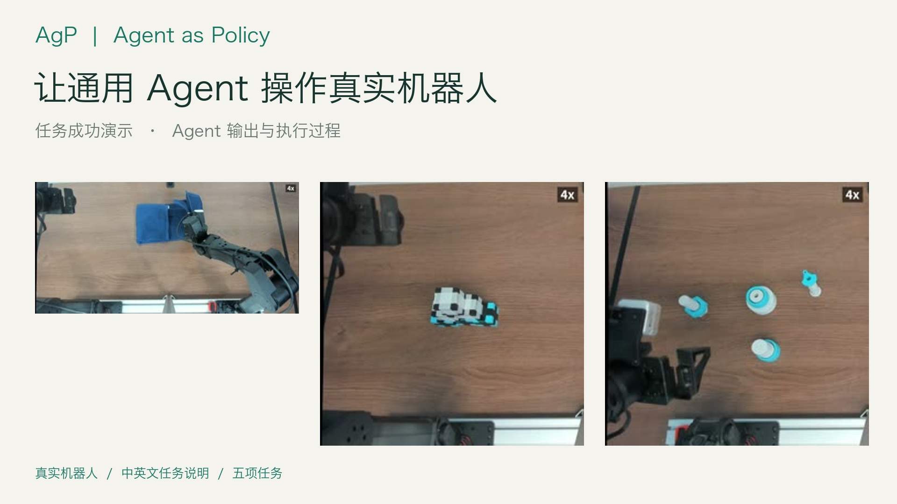
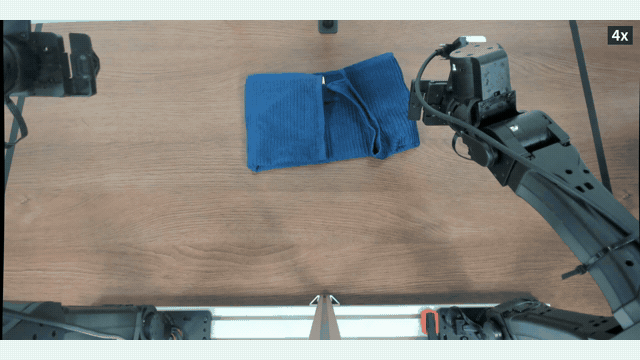
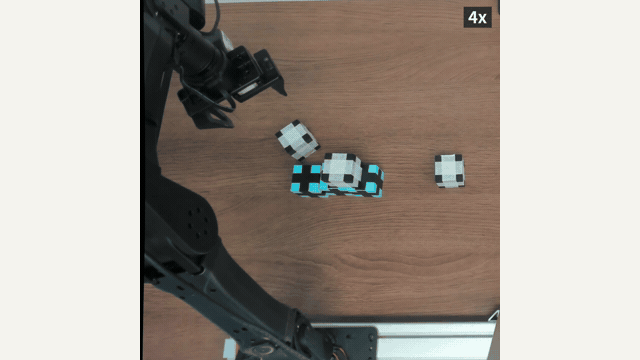
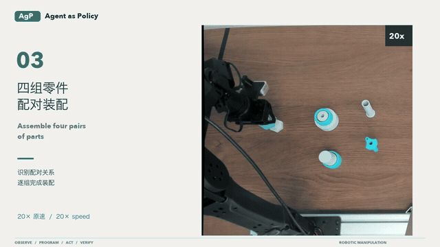
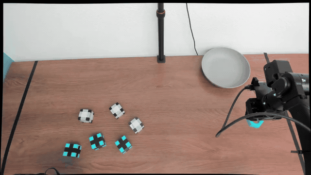
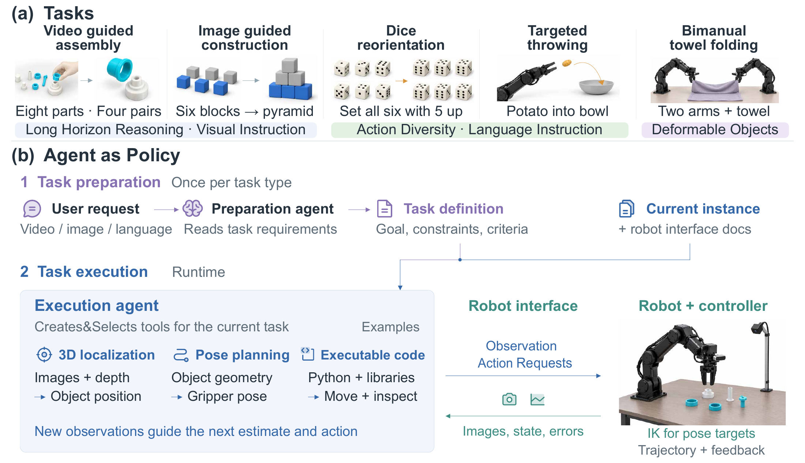

<div align="center">

# Agent as Policy
### Agent as Policy for Robotic Manipulation

**General-purpose agents observe, program, act, and verify on real robots.**

Mengzhao Jia · Yang Lin · Xixin Zhang · Zhihan Zhang · Xiaobai Liu · Meng Jiang

<a href="https://agent-as-policy-2026.github.io/"></a>
<a href="https://arxiv.org/abs/2609.12541"></a>
<a href="https://github.com/user-attachments/assets/1ccd77b9-64c3-4755-9408-e18a936907dc"></a>
<a href="https://huggingface.co/datasets/Agent-as-Policy/agent-as-policy"></a>

</div>

<p align="center">
  <a href="https://github.com/user-attachments/assets/1ccd77b9-64c3-4755-9408-e18a936907dc"></a>
</p>
<p align="center"><b><a href="https://github.com/user-attachments/assets/1ccd77b9-64c3-4755-9408-e18a936907dc">▶ Watch the project video</a></b> · 38 sec · Task demonstrations and recorded agent execution</p>

<details>
<summary><b>▶ Play the project video here</b></summary>

https://github.com/user-attachments/assets/1ccd77b9-64c3-4755-9408-e18a936907dc

</details>

**Agent as Policy (AgP)** uses a general-purpose agent as the policy for real-world robotic manipulation. Given a task and a documented robot interface, the agent interprets camera observations, writes executable programs, commands the robot, and revises its actions from physical feedback. Model parameters remain fixed during execution.

[**Demos**](#real-robot-demonstrations) · [**Method**](#how-it-works) · [**Results**](#results-from-the-paper) · [**Setup**](#getting-the-robot-sdk) · [**Running**](#running) · [**Citation**](#citation)

## Real robot demonstrations

From deformable objects to precision assembly and dynamic motion. Click a preview to watch the corresponding task video on the project website.

<table>
  <tr>
    <td align="center" width="50%">
      <a href="https://agent-as-policy-2026.github.io/media/towel-simultaneous-run-8x-views.mp4"></a><br>
      <b>Bimanual towel folding</b><br><sub>Coordinate two arms to fold a deformable object · 20× preview</sub>
    </td>
    <td align="center" width="50%">
      <a href="https://agent-as-policy-2026.github.io/media/blocks-pyramid-8x-views.mp4"></a><br>
      <b>Block construction</b><br><sub>Build a six-block pyramid from a goal image · 20× preview</sub>
    </td>
  </tr>
  <tr>
    <td align="center">
      <a href="https://agent-as-policy-2026.github.io/media/assembly-trial4-timelapse-8x-views.mp4"></a><br>
      <b>Precision assembly</b><br><sub>Match and assemble four pairs of parts · 20× preview</sub>
    </td>
    <td align="center">
      <a href="https://agent-as-policy-2026.github.io/media/throw-probe-then-throw-8x-views.mp4"></a><br>
      <b>Targeted throwing</b><br><sub>Release an object toward a target bowl · 1× preview</sub>
    </td>
  </tr>
</table>

Previews are selected excerpts from the promotional film. Linked task recordings play at 8× and may show a different trial of the same task. The [project page](https://agent-as-policy-2026.github.io/) also includes dice reorientation, alternative towel-folding strategies, and recorded agent sessions. Videos, per-step frames, joint trajectories, and full agent traces are available in the [dataset](https://huggingface.co/datasets/Agent-as-Policy/agent-as-policy).

## How it works

<p align="center">
  <a href="docs/assets/method-overview.png"></a>
</p>

1. **Prepare the task.** A preparation agent turns the request and video, image, or language references into a reusable definition with goals, constraints, and completion criteria.
2. **Observe and program.** The execution agent reads camera images and robot state, estimates geometry, and writes programs to choose poses and compose actions.
3. **Act and verify.** The robot bridge executes joint or Cartesian targets. Fresh observations and motion feedback guide the agent's next decision.

Saved procedures and programs can be reused across trials. The [paper](https://arxiv.org/abs/2609.12541) describes the task setup, controller, and evaluation protocol.

## Results from the paper

- **Real-world task coverage.** Assembly from human videos, block construction from goal images, dice flipping, targeted throwing, and bimanual towel folding.
- **Task completion.** At least 8 successful trials out of 10 for each evaluated assembly, block-construction, and dice-flipping configuration.
- **Experience reuse.** Reusing saved procedures and programs shortens execution time across repeated trials.

See the [paper](https://arxiv.org/abs/2609.12541) for per-task results and experimental conditions.

## What is here

| Path | Contents |
|---|---|
| `agp/` | Experiment harness: session server (`server_real.py`), the agent's CLI (`robot_client.py`), prompts and interface contracts, the runners, and the bridge launcher `start_bridges.sh` |
| `agp/tools/` | Session helpers and the metrics scripts that produce the paper tables |
| `agp/knowledge/`, `agp/paper_runs/` | The note/tool stores carried between trials, and the per-batch `results.csv` with before/after photos |
| `hardware-bridge/` | Safety-owned bridge that exclusively owns the arms and cameras — its own uv project, documented in `hardware-bridge/README.md` |
| `calib/` | Hand-eye and overhead-camera calibration procedures (`calib/README_runbook_zh.md`) |
| `third_party/graph-as-policy/` | The vendored connector package (`gap`, `gap_core`), Apache-2.0, pinned to one upstream commit (see its `UPSTREAM.md`) |
| `third_party/i2rt/` | Patch + pinned upstream commit for the robot SDK (see its `UPSTREAM.md`) |

The bridge ships as the Python package `agp_yam_bridge` with three console
scripts: `agp-yam-preflight`, `agp-yam-bridge`, `agp-yam-camera-acceptance`.

## Getting the robot SDK

The bridge depends on a patched i2rt checkout at `<repo>/i2rt` (its uv source is
`../i2rt`). Clone it there, pin the commit, apply our patch **without committing
it**, then copy the untracked additions; the exact commands are in
`third_party/i2rt/UPSTREAM.md`.

## Running

```bash
# 0. once per checkout, after the SDK step above: build the bridge environment. It is
#    also the interpreter the harness runs on, and it is what makes `gap` importable.
(cd hardware-bridge && uv sync --locked)

# 1. bring up a bridge (per arm; --source fake needs no hardware — see hardware-bridge/README.md)
bash agp/start_bridges.sh start left
bash agp/start_bridges.sh status

# 2. a goal set for the task: a photo of the goal state, or a recorded human demonstration
G=agp/goal_sets/$(date +%Y%m%d)_<task>; mkdir -p $G
cp <photo>.jpg $G/test_1.jpg && bash agp/capture_top.sh $G/top_camera.png
bash agp/record_demo.sh <task>

# 3. one supervised trial: it takes the before-photo, then waits for Enter before the arm moves
bash agp/run_trial.sh <task> <trial_no> [--effort high] [--model <slug>] \
     [--bare] [--right | --dual] [--knowledge task|ckpt|mx]
PAPER_DRYRUN=1 bash agp/run_trial.sh <task> 1   # print the resolved config, start nothing

# 4. results in agp/paper_runs/<task>_<batch>/ (results.csv, before/after photos);
#    the session (videos, joints, agent events) in agp/sessions/
bash agp/start_bridges.sh stop left
```

Large artefacts referenced by these steps (goal sets, demo videos, session
recordings) come from the Hugging Face dataset or from Drive.

## License

Code in this repository is Apache-2.0 (`LICENSE`); `NOTICE` carries the
third-party attributions that come with it. The dataset on Hugging Face is
CC BY 4.0. The vendored connector under `third_party/graph-as-policy/` is
Apache-2.0 and modified, upstream `LICENSE` and `NOTICE.md` preserved. The
vendored SDK under `third_party/i2rt/` remains MIT, upstream notice preserved.

## Citation

```bibtex
@article{jia2026agent,
  title   = {Agent as Policy for Robotic Manipulation},
  author  = {Jia, Mengzhao and Lin, Yang and Zhang, Xixin and
             Zhang, Zhihan and Liu, Xiaobai and Jiang, Meng},
  journal = {arXiv preprint arXiv:2609.12541},
  year    = {2026},
  doi     = {10.48550/arXiv.2609.12541},
  url     = {https://arxiv.org/abs/2609.12541}
}
```
